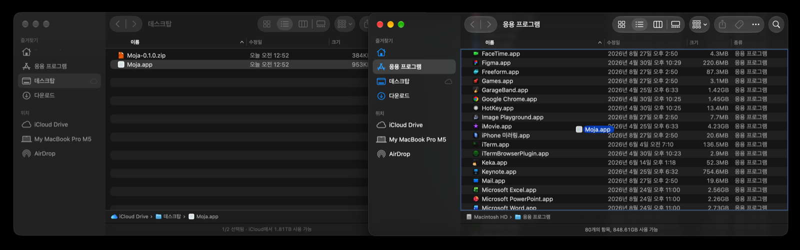
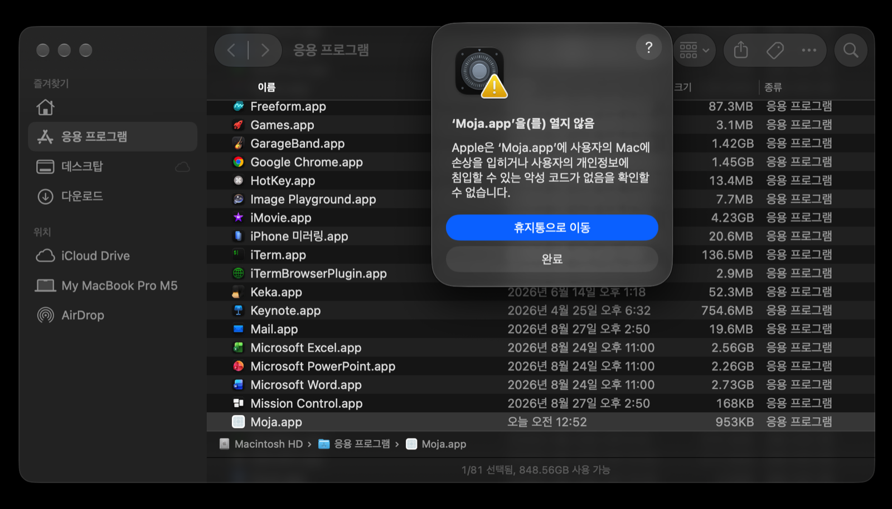
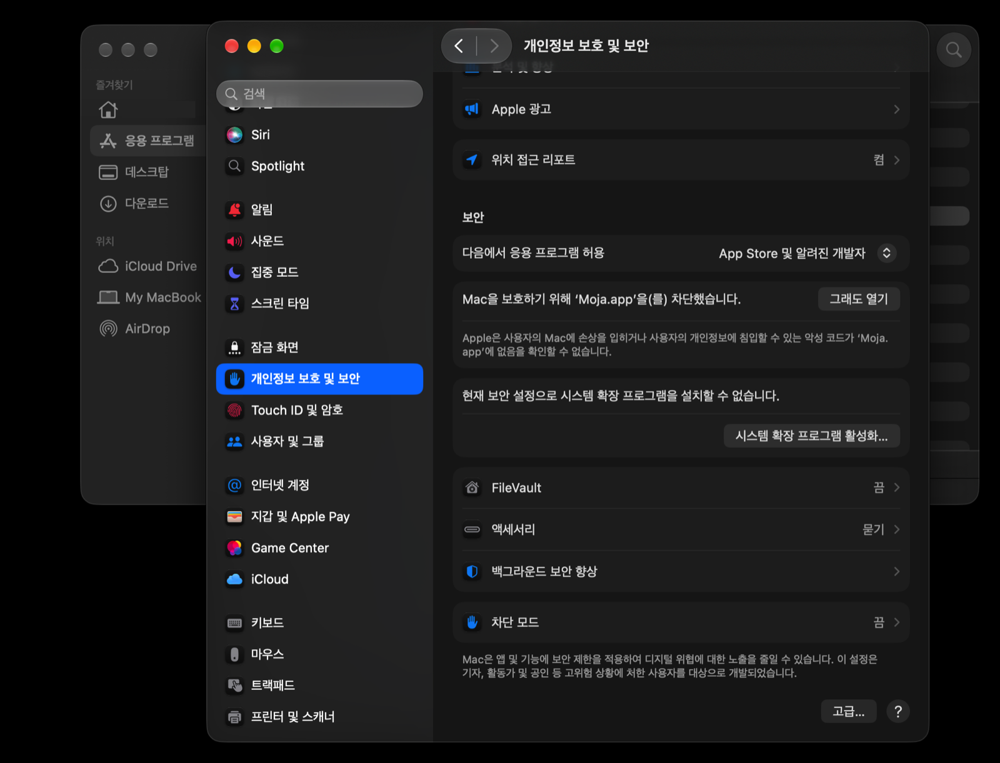

# 'Moja'는 뭘 하는 앱인가요?

**`ㅂㅗㄱㅗㅅㅓ.docx`**

맥에서 파일 이름을 한글로 저장하고, 이걸 윈도우 사용자에게 보내면 'ㅂㅗㄱㅗㅅㅓ.docx' 처럼 파일 이름이 깨진다는 사실 알고 계신가요?

**Moja는 윈도우에서도 한글 파일 이름이 멀쩡하게 보이도록 관리해 줍니다.**
설치하고, 관리할 폴더를 정한 후에 접근 권한만 허용해 주면 됩니다.

<!-- 스크린샷 자리: 메뉴바 아이콘을 클릭해 메뉴가 열린 모습 -->

---

## 받기

> **아직 정식 버전이 아닙니다. (v0.1.0).**
> 기능은 정식 버전과 같지만, 사용자 환경에 따라 오류가 생길 수 있습니다.

[Releases](../../releases)에서 `Moja-x.y.z.zip`을 다운로드하세요.

## 설치 (3단계)

> Moja는 Apple의 공식 승인을 받은 프로그램이 아닙니다. '확인되지 않은 개발자', '악성소프트웨어' 같은 무시무시한 경고가 나오지만, 안심하고 설치하셔도 됩니다.
>
> 아래 화면은 **macOS 골든게이트** 기준입니다. macOS 버전에 따라 창 모양과 버튼 이름이
> 다를 수 있습니다. → [내 macOS에서는 화면이 다릅니다](#내-macos에서는-화면이-다릅니다)

**1. 다운받은 파일의 압축을 풀고 `Moja.app`을 응용 프로그램 폴더로 옮기세요.**



**2. 더블클릭하면 "'Moja.app'을(를) 열지 않음" 경고가 나옵니다. `완료`를 누르세요.**

`휴지통으로 이동`이 파란색으로 강조되어 있지만, 그걸 누르면 앱이 지워집니다.
회색으로 흐릿한 `완료` 쪽입니다.



**3. 시스템 설정 → 개인정보 보호 및 보안 → 아래 `보안` 항목에서 `그래도 열기`를 누르세요.**

"Mac을 보호하기 위해 'Moja.app'을(를) 차단했습니다"라는 줄이 보입니다.
이 줄은 2번에서 앱을 한 번 실행해 봤을 때만 나타납니다. 안 보이면 2번을 먼저 해 주세요.
버튼을 누르면 Touch ID나 암호를 물어보고, 마지막으로 한 번 더 확인 창이 뜹니다.
거기서 `열기`를 누르면 끝입니다.



이제 메뉴바에 아이콘이 생깁니다. 처음 실행하면 어떤 폴더를 지켜볼지 물어봅니다.
데스크탑·다운로드·문서를 고르면 macOS가 접근을 허락할지 한 번 더 묻습니다.

### 내 macOS에서는 화면이 다릅니다

허용 절차는 macOS 버전마다 조금씩 달라졌습니다. 그러나 하는 일은 같습니다.
**"이 앱을 알고 실행하는 게 맞다"고 시스템에 한 번 확인해 주는 것**입니다.

| macOS | 2번 경고창 | 허용하는 곳 |
|---|---|---|
| 골든게이트, 15 Sequoia | `휴지통으로 이동` / `완료` | 시스템 설정 → 개인정보 보호 및 보안 → `그래도 열기` (위 3번) |
| 13 Ventura, 14 Sonoma | `휴지통으로 이동` / `취소` | 같은 자리의 `확인 없이 열기`. 또는 응용 프로그램 폴더에서 `Moja.app`을 **Control-클릭(우클릭) → 열기** → 다시 뜨는 창에서 `열기` |

우클릭으로 여는 방법은 macOS 15부터 막혔습니다. 그 이후 버전에서는 시스템 설정을
거쳐야 합니다. 어느 쪽이든 처음 한 번만 하면 되고, 다음부터는 그냥 열립니다.

> **왜 이런 단계가 필요한가요?** Apple에 개발자 등록(연 $99)을 하면 없앨 수 있습니다.
> 쓰는 사람이 어느 정도 모이면 등록할 계획입니다.

---

## 무엇을 하나요

지켜보는 폴더 안에서 **자소가 분리된 한글 이름**을 **조합된 형태**로 되돌립니다.
하위 폴더까지 함께 봅니다.

- 파일을 만들거나, 이름을 바꾸거나, 다른 곳에서 끌어다 놓으면 몇 초 안에 정리됩니다
- 이미 쌓여 있는 파일은 메뉴의 **기존 항목 일괄 변환**으로 한 번에 처리합니다.
  실행 전에 무엇이 어떻게 바뀔지 먼저 보여 줍니다
- 폴더는 여러 개 등록할 수 있고, 각각 켜고 끌 수 있습니다

### 건드리지 않는 것

확신이 없으면 바꾸지 않는 쪽을 택했습니다.

| 대상 | 이유 |
|---|---|
| 숨김 파일, `.DS_Store` | 사용자가 보는 이름이 아닙니다 |
| `.download` · `.crdownload` · `.part` 등 | 받는 중입니다. 건드리면 다운로드가 깨집니다 |
| `~$`로 시작하는 파일 | 워드·엑셀이 문서를 열어 둔 동안 만드는 파일입니다 |
| 앱 꾸러미(`.app` 등) **안쪽** | 서명이 깨집니다. 꾸러미 자체의 이름은 바꿉니다 |
| 방금 저장된 파일 | 아직 쓰는 중일 수 있어 잠시 기다립니다 |
| 심볼릭 링크가 가리키는 곳 | 지켜보는 폴더 **밖**을 건드리게 됩니다 |

한 번에 500개가 넘게 들어오면 자동 변환을 멈추고 알려 줍니다. 클라우드 폴더가
처음 동기화될 때처럼 파일이 쏟아지는 상황에서 폭주하지 않기 위해서입니다.
그럴 때는 일괄 변환을 쓰면 됩니다.

---

## 한계

**모자는 디스크에 적힌 이름만 바꿉니다.** 파일을 보내는 경로에는 개입하지 않습니다.
일부 앱과 저장 장치는 전송·복사 과정에서 이름을 다시 바꿉니다.

**변환이 아예 불가능한 디스크가 있습니다.** macOS의 exFAT·HFS+ 드라이버는 파일 이름을
커널 수준에서 강제로 분해해 저장합니다. 조합형 이름으로 직접 만들어도 분해형으로
저장되므로, 어떤 방법으로도 바꿀 수 없습니다. 모자는 이런 디스크를 알아보고
"지원하지 않습니다"로 표시한 뒤 건드리지 않습니다.
자세한 측정 결과는 [kb/wiki/research/rename-measurements.md](kb/wiki/research/rename-measurements.md)에 있습니다.

### 전송 경로 검증

변환된 파일을 아래 경로로 보냈을 때 받는 쪽(Windows)에서 정상인지 기록한 표입니다.

| 경로 | 결과 | 비고 |
|---|---|---|
| USB 메모리 (exFAT) | ❌ 깨짐 | **모자가 고칠 수 없음.** macOS가 복사할 때 이름을 다시 분해해 저장합니다 |
| 파인더 기본 압축 (zip) | ⚠️ 조건부 | 조합형은 유지되지만 zip에 UTF-8 표시가 빠집니다 (아래 설명) |
| macOS 기본 메일 앱 첨부 | 미검증 | |
| Gmail 웹 첨부 (사파리·크롬) | 미검증 | |
| 카카오톡 맥 | 미검증 | |
| 슬랙 맥 | 미검증 | |
| 구글 드라이브 데스크탑 동기화 | 미검증 | |
| 원드라이브 동기화 | 미검증 | |
| 아이클라우드 드라이브 → 윈도우 iCloud | 미검증 | |
| AirDrop → 아이폰 → 윈도우 | 미검증 | |

**zip에 대해**: macOS로 만든 zip은 이름을 조합형으로 올바르게 담습니다. 그런데
"이 이름은 UTF-8이다"라는 표시(UTF-8 플래그)를 넣지 않습니다. Windows 탐색기는
그 표시가 없으면 시스템 기본 인코딩으로 읽으려 하기 때문에 한글이 깨질 수 있습니다.
**이건 자소 분리와는 별개의 문제이고, 모자가 고칠 수 있는 부분이 아닙니다.**
받는 쪽에서 반디집·7-Zip처럼 UTF-8을 알아서 처리하는 프로그램을 쓰면 해결됩니다.

미검증 항목은 실제로 확인한 뒤에 채웁니다. 확인해 보셨다면
[이슈](../../issues)로 알려 주시면 표에 반영하겠습니다.

---

## 기존 도구와의 관계

| | 방식 | 한계 |
|---|---|---|
| [반디네이머](https://www.bandisoft.co.kr/bandizip/) 등 이름 변경 도구 | 수동 일괄 변환 | 변환 후 파인더에서 이름을 고치거나 파일을 옮기면 다시 분해형으로 돌아갑니다 |
| [jaso](https://github.com/hsol/jaso) | 자동 감시 (같은 접근) | Python 런타임을 함께 배포, 서명 없음, 설치할 때 시스템 보안을 꺼야 했습니다. 개발자가 유지보수 중단을 알렸습니다 |
| `convmv`, `nfd2nfc` 등 | 명령줄 | 터미널을 쓸 줄 알아야 합니다 |

**모자가 채우는 자리**: jaso와 같은 일을 하되, **내려받아 더블클릭하면 끝나는 버전**입니다.
외부 런타임이 없고(순수 Swift), 시스템 보안 설정을 끄라고 요구하지 않습니다.

---

## 개인정보

- **인터넷에 아무것도 보내지 않습니다.** 네트워크 연결을 아예 만들지 않습니다.
- 기록은 `~/Library/Logs/Moja/Moja.log`에만 남습니다. 1MB가 넘으면 회전하고
  직전 것 하나만 보관합니다.
- 설정(지켜보는 폴더 목록)은 이 맥의 `UserDefaults`에만 저장됩니다.

---

## 요구 사항

- macOS 13 Ventura 이상
- Apple Silicon / Intel (Universal)
- 약 1MB

---

## 개발

```sh
brew install xcodegen          # 빌드 도구. 앱 자체의 서드파티 의존성은 0개

./scripts/build.sh             # 빌드 → build/Build/Products/Debug/Moja.app
./scripts/test.sh              # CoreKit 단위·통합 테스트 (138개)
./scripts/release.sh           # 릴리스 빌드 → zip
swift scripts/acceptance.swift # 수용 기준 자동 검증 (실제 앱을 띄워 확인)
open Moja.xcodeproj            # Xcode에서 열기
```

`Moja.xcodeproj`는 **생성물**입니다. 빌드 설정은 [project.yml](project.yml)에서만 바꿉니다.

### 구조

```
App/       메뉴바 UI, 온보딩, 창 관리        SwiftUI + 필요한 곳만 AppKit
CoreKit/   변환 로직                        순수 Foundation, UI 의존 없음
           Normalizer  이름 → 조합형 판정·변환
           Planner     건너뛰기 규칙, 깊이 우선 정렬, 폭주 방지
           Renamer     이름 변경과 검증
           Watcher     FSEvents, 디바운스, 무시 목록
           Store       설정, 로그
scripts/   빌드·테스트·릴리스·수용 검증·픽스처·지식 베이스 도구
kb/wiki/   요구사항, 측정 기록, 수용 결과                지식 그래프가 관계를 잇는다
kb/raw/    외부 원자료 (볼륨 실측 출력, 참고 문헌)       쓴 뒤 고치지 않는다
docs/images/ README 스크린샷
```

### 테스트 파일 만들기

자소가 분리된 이름의 파일을 만들어 줍니다. 대상 폴더를 반드시 인자로 넘겨야 합니다.

```sh
./scripts/make-nfd-fixtures.sh ~/tmp/moja-test
```

> **주의**: 파일 이름 시험을 셸로 준비하면 안 됩니다. zsh는 글로빙 결과를 조합형으로
> 정규화하기 때문에, `cp staging/* watched/` 같은 명령은 분해형 이름을 조합형으로
> **바꿔서** 복사합니다. 실제로 이 함정에 한 번 빠졌습니다
> ([kb/wiki/research/rename-measurements.md](kb/wiki/research/rename-measurements.md) 2.4절).

### 문서

- [kb/wiki/spec/requirements.md](kb/wiki/spec/requirements.md): v1 요구사항과 구현이 문서와 달라진 지점
- [kb/wiki/research/rename-measurements.md](kb/wiki/research/rename-measurements.md): 파일시스템별 실측 결과
- [kb/wiki/spec/acceptance-results.md](kb/wiki/spec/acceptance-results.md): 수용 기준 검증 결과
- [kb/wiki/index.md](kb/wiki/index.md): 지식 베이스 전체 색인

---

## 릴리스까지 남은 일

v1.0.0은 수용 기준 16개를 전부 통과해야 합니다. 현재 12개 자동 통과, 1개 수동 확인.

<!-- roadmap:release-checklist:start -->
- [ ] **T13** 로그인 시 자동 실행: 실제 재로그인으로 확인합니다.
      ad-hoc 서명에서는 의미가 없으므로 서명을 붙인 뒤에 확인해야 합니다
- [ ] **T15** 24시간 방치: 메모리 30MB 이하 유지 확인
- [ ] **T16** Windows에서 열기: 위 전송 경로 표 채우기
- [x] 설치 안내 스크린샷 3장: macOS 골든게이트 기준입니다. 이전 버전 화면은 표로만 안내합니다
- [ ] Developer ID 서명 + 공증 (`scripts/release.sh`에 절차는 준비됨)
- [ ] Homebrew cask 등록
<!-- roadmap:release-checklist:end -->

---

## 라이선스

[MIT](LICENSE)
