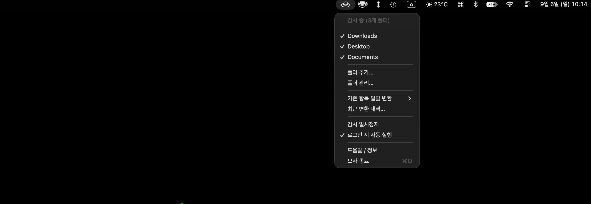

# 'Moja'는 뭘 하는 앱인가요?

**`ㅂㅗㄱㅗㅅㅓ.docx`**

맥에서 파일 이름을 한글로 저장하고, 이걸 윈도우 사용자에게 보내면 'ㅂㅗㄱㅗㅅㅓ.docx' 처럼 파일 이름이 깨진다는 사실 알고 계신가요?

**Moja는 윈도우에서도 한글 파일 이름이 멀쩡하게 보이도록 관리해 줍니다.**
설치하고, 관리할 폴더를 정한 후에 접근 권한만 허용해 주면 됩니다.

---

## 받기

> **아직 정식 버전이 아닙니다. (v0.1.0).**
> 기능은 정식 버전과 같지만, 실제 사용 환경 테스트가 완료 안 된 상태입니다. 사용자의 맥OS 버전이나 개인 설정에 따라서 오류가 발생할 수 있습니다.

[Releases](../../releases)에서 `Moja-x.y.z.zip`을 다운로드하세요.

## 설치 (3단계)

> Moja는 Apple의 공식 승인을 받은 프로그램이 아닙니다. '확인되지 않은 개발자', '악성소프트웨어' 같은 무시무시한 경고가 나오지만, 안심하고 설치하셔도 됩니다.
>
> 아래 설치 화면은 **macOS 골든게이트**입니다. macOS 버전에 따라 창 모양이나 버튼 이름이
> 다를 수 있습니다. → [맥OS 버전별 권한 허용](#맥os-버전별-권한-허용)

**1. 다운받은 파일의 압축을 풀고 `Moja.app`을 응용 프로그램 폴더로 옮기세요.**

**2. 더블클릭하면 "'Moja.app'을(를) 열지 않음" 경고가 나옵니다. `완료`를 누르세요.**

`휴지통으로 이동`이 파란색으로 강조되어 있지만, 그걸 누르면 앱이 지워집니다. `완료`를 클릭하세요.

**3. 시스템 설정 → 개인정보 보호 및 보안 → 아래 `보안` 항목에서 `그래도 열기`를 누르세요.**

"Mac을 보호하기 위해 'Moja.app'을(를) 차단했습니다"라는 내용이 보일 겁니다.
이 내용은 설치 2번 과정에서 앱을 한 번 실행했을 때만 나타납니다. 안 보이면 2번 과정을 먼저 진행해 주세요.
버튼을 누르면 Touch ID나 암호를 물어보고, 마지막으로 한 번 더 확인 창이 뜹니다.
거기서 `열기`를 누르면 됩니다.

이제 메뉴바에 아이콘이 생깁니다. 처음 실행하면 어떤 폴더를 관리할지 물어봅니다.
데스크탑·다운로드·문서를 고르면 macOS가 접근을 허락할지 한 번 더 묻는데, 동의해 주시면 됩니다.

### 맥OS 버전별 권한 허용

권한 허용 절차와 방법은 macOS 버전마다 조금씩 다릅니다.

| macOS | 경고창 | 허용하는 곳 |
| --- | --- | --- |
| 골든게이트, 15 Sequoia | `휴지통으로 이동` / `완료` | 시스템 설정 → 개인정보 보호 및 보안 → `그래도 열기` (위 3번) |
| 13 Ventura, 14 Sonoma | `휴지통으로 이동` / `취소` | 같은 자리의 `확인 없이 열기`. 또는 응용 프로그램 폴더에서 `Moja.app`을 **Control-클릭(우클릭) → 열기** → 다시 뜨는 창에서 `열기` |

macOS 15부터는 우클릭으로 열기가 안 됩니다. 그 이후 버전에서는 시스템 설정을 거쳐야 합니다. 처음 한 번만 허용해 주면 다음부터는 그냥 열립니다.

> 취미로 하는 개발에 딱히 돈 쓸 생각이 없어서 Apple에 정식 개발자 등록(연 $99)을 안 했습니다. '확인되지 않은 개발자' 경고가 뜨는 이유입니다. 설정이 조금 번거로운 거는 넓은 아량으로 이해해 주시면 감사하겠습니다.

---

## 기능

관리 대상 폴더 안에서 **한글 파일 이름을 자모가 조합된 형태로** 변환합니다.
관리 대상 폴더의 하위 폴더까지 함께 관리합니다.

- 관리 대상 폴더 안에 파일을 만들거나, 파일 이름을 바꾸거나, 다른 경로에서 파일을 가져오기만 해도 몇 초 안에 정리됩니다
- 폴더 안에 이미 있던 파일은 **기존 항목 일괄 변환** 메뉴로 한 번에 처리할 수 있습니다. 실행하기 전에 어떤 이름이 어떻게 바뀌는지 먼저 보여 줍니다
- 폴더를 여러 개 관리할 수 있고, 폴더마다 따로 켜고 끌 수 있습니다

### 바꾸지 않는 파일

아래 파일은 바꾸지 않습니다.

| 대상 | 이유 |
| --- | --- |
| 숨김 파일 | 사용자 눈에 보이지 않는 설정 파일일 가능성이 있습니다 |
| `.download` · `.crdownload` · `.part` 등 | 다운로드 중인 파일 이름을 바꾸면 다운로드가 실패합니다 |
| `~$`로 시작하는 파일 | 워드·엑셀이 문서를 열어 둔 동안 만드는 파일입니다 |
| 앱 번들(`.app` 등) **내부** | 앱이 실행되지 않게 됩니다. 번들 자체의 이름은 바꿉니다 |
| 방금 저장한 파일 | 아직 저장하는 중일 수 있어서 잠시 기다립니다 |

한 번에 500개가 넘게 들어오면 자동 변환을 멈추고 알려 드립니다. 이때는 일괄 변환으로 처리해 주시면 됩니다.

---

## 한계

**Moja는 개인 컴퓨터에 있는 파일 이름은 자모가 합쳐진 상태로 바꿉니다.** 그런데 이 파일을 이메일이나, 카톡, 슬랙 등으로 전송하는 과정에서 조합이 다시 깨질 가능성이 있습니다. 이거는 Moja가 해결할 수 없는 부분입니다.

**변환할 수 없는 디스크도 있습니다.** USB 메모리처럼 exFAT이나 HFS+로 만들어진 디스크에서는 어떤 방법으로도 바꿀 수 없습니다.
Moja는 이런 디스크를 인식해서 "이 디스크(exFAT)는 변환을 지원하지 않습니다"라고 표시합니다.

### 전송 경로 검증

Moja에서 변환한 파일을 아래 방법으로 보냈을 때, Windows에서 자모가 안 깨지고 정상으로 보이는지 확인한 결과입니다.

| 경로 | 결과 | 비고 |
| --- | --- | --- |
| 파인더 기본 압축 (zip) | 유지됨 | 상대방이 반디집으로 압축을 풀었을 경우 |
| 카카오톡 파일 공유 | 유지됨 | |
| 슬랙 파일 공유 | 유지됨 | |
| 구글 드라이브 업로드 | 깨짐 | |
| 원드라이브 동기화 | 미검증 | |
| 아이클라우드 드라이브 → 윈도우 iCloud | 깨짐 | |
| AirDrop → 아이폰 → 윈도우 | 미검증 | |

#### 메일 첨부

Moja로 수정한 파일을 메일 첨부로 보낼 때, 사용하는 메일 서비스에 따라서도 결과가 달라집니다. (골치가 아프군요...)

| 보내는 쪽 | 받는 쪽 | 결과 |
| --- | --- | --- |
| 네이버 메일 (웹) | 네이버 메일 | 유지됨 |
| 네이버 메일 (웹) | 지메일 | 깨짐 |
| 지메일 (웹) | 지메일 | 깨짐 |
| 지메일 (웹) | 네이버 메일 | 유지됨 |
| macOS 기본 메일 앱 | 네이버 메일 | 유지됨 |
| macOS 기본 메일 앱 | 지메일 | 유지됨 |

미검증 항목은 직접 확인한 뒤에 채워 넣고 있습니다. 확인되는 대로 업데이트하겠습니다.

---

## 대안들

한글 이름의 자모 분리 문제는 널리 알려진 문제인 만큼 대체할 앱들이 있습니다.
사용자 상황에 따라 골라서 사용하시면 됩니다.
Moja는 기존 앱보다 (한끗 차이로) 편리한 앱을 지향합니다.

| 도구 | 방식 | 한계 |
| --- | --- | --- |
| [반디네이머](https://www.bandisoft.co.kr/bandizip/) 이름 변경 도구 | 수동 일괄 변환 | 변환 후 파인더에서 이름을 고치거나 파일을 옮기면 다시 분해형으로 저장됩니다 |
| [jaso](https://github.com/hsol/jaso) | 자동 감시 (Moja와 같은 방식) | Python을 따로 설치해야 합니다. 설치할 때 시스템 보안을 꺼야 하는 것 같습니다. 유지보수가 중단된 상태입니다 |
| `convmv`, `nfd2nfc` 등 | CLI 명령어 입력 | 터미널을 사용할 줄 알아야 합니다 |

**Moja는 무엇이 다른가요**: Moja의 기능은 jaso와 거의 유사합니다. 사용자가 일일이 바꿔야 할 파일을 지정하는 대신, 처음에 관리할 폴더만 지정해 두면 알아서 바꿔 줍니다. 파이썬을 설치해야 한다거나, 터미널 사용법을 따로 알아야 할 필요가 없습니다. 다운받아서 프로그램 설치만 하면 됩니다.

---

## 개인정보

- 개인정보 입력을 요청하지 않습니다.
- 작업 기록과 설정은 설치하신 맥 안에만 저장합니다.
- 인터넷 연결 없이 동작하므로, 저장한 설정이나 기록을 몰래 빼내서 정체 모를 서버로 전송하거나 그러지 않습니다.

---

## 요구 사항

- macOS 13 Ventura 이상
- Apple Silicon / Intel (Universal)
- 약 1MB

---

## 라이선스

[MIT](LICENSE)

개발 문서는 [docs/development.md](docs/development.md)에 있습니다.

---

## 문의

사용법이나 오류 등 문의할 내용이 있으시다면 아래로 연락주세요.
가능한 범위 안에서 답변 드리겠습니다.

[liam.nextdomain@gmail.com](mailto:liam.nextdomain@gmail.com)
